# Medieval cutouts

40 medieval manuscript-style illustrations, each available as a PNG and a lossless WebP. Most are transparent cutouts; `animal-musicians-ensemble` preserves the supplied image exactly, including its background and border.

PNG originals are in [`png/`](png/); matching WebP versions are in [`webp/`](webp/). Both formats retain the same dimensions and transparency. [`images.json`](images.json) lists original files and every smaller variant, with exact paths, dimensions, and file sizes. Each entry also has a description, categories, subjects, facing, colors, and composition to help people and LLMs choose an image. See [the selection guide](SELECTION.md) or [browse by category](#browse-by-category).

The twelve musicians from the three-row, four-column illustration use `r1-c1` through `r3-c4` in their filenames.

Cutouts were prepared from supplied illustrations using image generation and background extraction. WebP conversion is lossless; visible pixels and alpha channels were checked against the PNG originals.

The supplied original for [`creature-in-gold-shape`](png/creature-in-gold-shape.png) is retained in [`sources/`](sources/). Its corrected extraction preserves the pale curved body that was previously mistaken for background, and is capped at the source's 650px longest edge. Image generation can reinterpret fine details; this is not a pixel-exact historical extraction. The correction prompt is recorded in [EXTRACTION-PROMPTS.json](EXTRACTION-PROMPTS.json).

For adding images or making changes, follow [the repository guide](AGENTS.md). `CLAUDE.md` imports it so agent instructions stay in one place.

## Smaller sizes

Smaller versions use 128, 256, 512, and 768 pixel limits in both formats. The number is the **longest edge**, so a portrait image stays portrait and a landscape image stays landscape. Images are never cropped, stretched, or enlarged. A limit is skipped when the original is already that size or smaller; use the original instead. Check `images.json` for each image's available versions.

| Longest edge | PNG folder | WebP folder | Example use |
| --- | --- | --- | --- |
| 128 px | [`png/128/`](png/128/) | [`webp/128/`](webp/128/) | Small corner decorations and thumbnails |
| 256 px | [`png/256/`](png/256/) | [`webp/256/`](webp/256/) | Small decorations on high-density displays |
| 512 px | [`png/512/`](png/512/) | [`webp/512/`](webp/512/) | Medium illustrations |
| 768 px | [`png/768/`](png/768/) | [`webp/768/`](webp/768/) | Larger illustrations |
| Original | [`png/`](png/) | [`webp/`](webp/) | Full resolution |

Each smaller version is generated directly from the original PNG using Lanczos resampling, preserving its transparency or opaque background. PNG and WebP encoding is lossless after resizing. Originals and their URLs remain unchanged.

## Use in another project

Link directly to the desired size:

```text
https://raw.githubusercontent.com/adrian729/medieval-cutouts/main/webp/128/flying-pig.webp
https://raw.githubusercontent.com/adrian729/medieval-cutouts/main/png/256/flying-pig.png
```

For a 128-pixel square flying pig, this lets the browser choose a 128-pixel image on a normal display or a 256-pixel image on a display with twice the pixel density:

```html

```

Other images have different proportions; use their actual dimensions from `images.json`. Use a commit SHA in place of `main` if you need a fixed version of an image. See [MDN's image documentation](https://developer.mozilla.org/en-US/docs/Web/HTML/Reference/Elements/img#srcset) for browser size selection.

## Regenerate sizes

```sh
python3 -m pip install -r requirements.txt
python3 scripts/generate_sizes.py
```

The script verifies dimensions, transparency, matching visible PNG/WebP pixels, and that every original remains byte-for-byte unchanged. See [Pillow's thumbnail documentation](https://pillow.readthedocs.io/en/stable/reference/Image.html#PIL.Image.Image.thumbnail) for the downscaling operation.

<!-- category-index:start -->
## Browse by category

Categories overlap. See [the selection guide](SELECTION.md) for tag meanings and size selection.

| Category | Images |
| --- | --- |
| [Animals](#animals) | 24 |
| [Fantasy](#fantasy) | 19 |
| [Humans](#humans) | 15 |
| [Hybrids](#hybrids) | 7 |
| [Music](#music) | 27 |
| [Reading](#reading) | 2 |
| [Royalty](#royalty) | 1 |

### Animals

<details>
<summary>Show 24 images</summary>

- [animal-choir-landscape](webp/animal-choir-landscape.webp) — A herd of cattle and a small hoofed animal face left toward a wooden music stand with an open score, with two small birds flying above and a narrow greenish ground strip beneath the full group.
- [animal-musicians-ensemble](webp/animal-musicians-ensemble.webp) — A complete framed manuscript scene on green grass with a patterned blue, gold, and pink background: animals gather around an open score, a bowed string player, a donkey at a pipe organ, white geese, a red animal with bagpipes and a drum, a pale animal ringing bells, and a harp lying on the ground.
- [bird-wind-player](webp/bird-wind-player.webp) — A dark bird-like creature with human arms and a pale blue patterned belly plays a long red and gold wind instrument facing left.
- [boar-lute-player](webp/boar-lute-player.webp) — An upright blue-gray boar plays a gold lute facing right.
- [bunny-harp](webp/bunny-harp.webp) — An upright brown rabbit facing right plays an orange and gold harp.
- [bunny-trumpet](webp/bunny-trumpet.webp) — A seated brown rabbit facing left plays a long gold trumpet extending to the left.
- [canine-fiddle-player](webp/canine-fiddle-player.webp) — A canine-headed figure in a blue tunic, red collar, and black boots strides left while playing a bowed fiddle, with its snout tilted upward.
- [cat-reading-book](webp/cat-reading-book.webp) — A seated blue-gray cat with a long striped tail and thin whiskers tilts its head up-right beside an open pale book, with a paw on the pages.
- [crowned-cat](webp/crowned-cat.webp) — A seated cream-colored cat with a long striped tail wears an ornate gold crown and shows a red tongue, looking mostly toward the viewer.
- [curled-cat](webp/curled-cat.webp) — A brown and gold cat curls into a compact rounded shape with its tail over its body and its face tilted toward the viewer.
- [donkey-organist](webp/donkey-organist.webp) — A seated gray donkey facing right plays a tall gold pipe organ positioned to its right.
- [donkey-rooster-lute-player](webp/donkey-rooster-lute-player.webp) — A half-donkey, half-rooster hybrid facing right wears an orange tunic and black waist pouch, with a gray donkey head, gold rooster legs, and a green feathered tail, playing a gold lute.
- [fish-with-arms](webp/fish-with-arms.webp) — A blue-green fish faces right with two pale human arms raised above its back and red cloth between them.
- [flying-pig](webp/flying-pig.webp) — A pink pig facing right has large gold feathered wings, a curled tail, and dangling legs.
- [frog](webp/frog.webp) — A broad green frog with dark spots crouches facing left.
- [funny-faced-lying-cat](webp/funny-faced-lying-cat.webp) — A lying orange-brown tabby cat faces the viewer with tucked front paws, tall triangular ears, broad eyes, and a funny almost human-looking expression in a softly textured painting.
- [lizard-lute-player](webp/lizard-lute-player.webp) — A gold lizard in a blue cap and tunic plays a pink and gold lute facing right, with clawed feet and a tail curving left.
- [rabbit-bagpiper](webp/rabbit-bagpiper.webp) — An upright gray rabbit faces left while playing pale round bagpipes, with a short pipe on the left and a very long gold pipe extending right.
- [rabbit-reading-book](webp/rabbit-reading-book.webp) — A brown rabbit with tall ears and a wide white eye leans left over an open pale book, with a paw resting on the marked pages.
- [seated-rabbit](webp/seated-rabbit.webp) — A tired-looking seated cream-colored rabbit faces right with tall ears, a half-closed eye, blue-green hindquarters and legs, and a thick black outline.
- [snail](webp/snail.webp) — An orange-brown snail faces right with long feelers and a large brown spiral shell.
- [weird-dog](webp/weird-dog.webp) — A seated shaggy dog-like creature has a human-like bearded face looking toward the viewer, dark paws, and a long curled tail.
- [white-animal-bagpiper](webp/white-animal-bagpiper.webp) — A seated pale animal-like creature with rounded ears, a long curled tail, and hand-like forelimbs faces the viewer while playing gold bagpipes.
- [winged-rabbit](webp/winged-rabbit.webp) — A blue-gray rabbit-like hybrid faces right with large brown feathered wings, a long feathered tail extending left, and clawed feet.

</details>

### Fantasy

<details>
<summary>Show 19 images</summary>

- [animal-choir-landscape](webp/animal-choir-landscape.webp) — A herd of cattle and a small hoofed animal face left toward a wooden music stand with an open score, with two small birds flying above and a narrow greenish ground strip beneath the full group.
- [animal-musicians-ensemble](webp/animal-musicians-ensemble.webp) — A complete framed manuscript scene on green grass with a patterned blue, gold, and pink background: animals gather around an open score, a bowed string player, a donkey at a pipe organ, white geese, a red animal with bagpipes and a drum, a pale animal ringing bells, and a harp lying on the ground.
- [bird-wind-player](webp/bird-wind-player.webp) — A dark bird-like creature with human arms and a pale blue patterned belly plays a long red and gold wind instrument facing left.
- [boar-lute-player](webp/boar-lute-player.webp) — An upright blue-gray boar plays a gold lute facing right.
- [bunny-harp](webp/bunny-harp.webp) — An upright brown rabbit facing right plays an orange and gold harp.
- [bunny-trumpet](webp/bunny-trumpet.webp) — A seated brown rabbit facing left plays a long gold trumpet extending to the left.
- [canine-fiddle-player](webp/canine-fiddle-player.webp) — A canine-headed figure in a blue tunic, red collar, and black boots strides left while playing a bowed fiddle, with its snout tilted upward.
- [cat-reading-book](webp/cat-reading-book.webp) — A seated blue-gray cat with a long striped tail and thin whiskers tilts its head up-right beside an open pale book, with a paw on the pages.
- [creature-in-gold-shape](webp/creature-in-gold-shape.webp) — A pale grotesque creature with a round face, dark mouthpiece-like object, raised arm, large curved pale body, and curling appendages sits within a curved gold form with a pointed upper-right extension.
- [donkey-organist](webp/donkey-organist.webp) — A seated gray donkey facing right plays a tall gold pipe organ positioned to its right.
- [donkey-rooster-lute-player](webp/donkey-rooster-lute-player.webp) — A half-donkey, half-rooster hybrid facing right wears an orange tunic and black waist pouch, with a gray donkey head, gold rooster legs, and a green feathered tail, playing a gold lute.
- [fish-with-arms](webp/fish-with-arms.webp) — A blue-green fish faces right with two pale human arms raised above its back and red cloth between them.
- [flying-pig](webp/flying-pig.webp) — A pink pig facing right has large gold feathered wings, a curled tail, and dangling legs.
- [lizard-lute-player](webp/lizard-lute-player.webp) — A gold lizard in a blue cap and tunic plays a pink and gold lute facing right, with clawed feet and a tail curving left.
- [rabbit-bagpiper](webp/rabbit-bagpiper.webp) — An upright gray rabbit faces left while playing pale round bagpipes, with a short pipe on the left and a very long gold pipe extending right.
- [rabbit-reading-book](webp/rabbit-reading-book.webp) — A brown rabbit with tall ears and a wide white eye leans left over an open pale book, with a paw resting on the marked pages.
- [weird-dog](webp/weird-dog.webp) — A seated shaggy dog-like creature has a human-like bearded face looking toward the viewer, dark paws, and a long curled tail.
- [white-animal-bagpiper](webp/white-animal-bagpiper.webp) — A seated pale animal-like creature with rounded ears, a long curled tail, and hand-like forelimbs faces the viewer while playing gold bagpipes.
- [winged-rabbit](webp/winged-rabbit.webp) — A blue-gray rabbit-like hybrid faces right with large brown feathered wings, a long feathered tail extending left, and clawed feet.

</details>

### Humans

<details>
<summary>Show 15 images</summary>

- [anafiles](webp/anafiles.webp) — Two seated human musicians facing left play long gold trumpets with red pennants inside a blue rectangular manuscript frame.
- [hooded-bagpiper](webp/hooded-bagpiper.webp) — A standing human facing right wears a pointed red-orange hood and tunic with green lining and black shoes, playing pale bagpipes with a long pipe extending left.
- [hooded-harp-player](webp/hooded-harp-player.webp) — A standing human facing left wears a tall blue hood, gold tunic, black leggings, and black shoes, playing a large gold harp held to the right.
- [musician-r1-c1-organ-player](webp/musician-r1-c1-organ-player.webp) — A seated human facing right wears a patterned cream cap, red sleeves, and a brown robe, holding small vertical organ pipes and gesturing right.
- [musician-r1-c2-shawm-player](webp/musician-r1-c2-shawm-player.webp) — A standing human facing right wears a cream cap, dark blue tunic, and red stockings, playing a long straight gold shawm extending right.
- [musician-r1-c3-horn-player](webp/musician-r1-c3-horn-player.webp) — A seated human facing right wears a pointed red and blue cap and a red-brown tunic, playing a pale curved horn pointing upward to the right.
- [musician-r1-c4-horn-player](webp/musician-r1-c4-horn-player.webp) — A seated human facing left wears a cream cap and long red robe, playing a pale curved horn extending left.
- [musician-r2-c1-bagpiper](webp/musician-r2-c1-bagpiper.webp) — A seated human facing right wears a dark blue cape with gold trim, red sleeves, and a cream cap and collar, playing pale bagpipes with a curved pipe extending right.
- [musician-r2-c2-bagpiper](webp/musician-r2-c2-bagpiper.webp) — A standing human facing right wears a green tunic, red sleeves, blue stockings, and a cream cap, playing pale gold bagpipes held against the chest.
- [musician-r2-c3-horn-player](webp/musician-r2-c3-horn-player.webp) — A seated human facing right wears a dark blue robe and cream cap, playing a large gold-green horn that curves upward to the right.
- [musician-r2-c4-psaltery-player](webp/musician-r2-c4-psaltery-player.webp) — A seated human in a dark robe and patterned cap looks down toward the left while playing a large gold psaltery held diagonally across the lap.
- [musician-r3-c1-bagpiper](webp/musician-r3-c1-bagpiper.webp) — A standing human facing right wears a green tunic, red sleeves and stockings, and a cream cap, playing a red patterned bagpipe with long green pipes extending left and right.
- [musician-r3-c2-lute-player](webp/musician-r3-c2-lute-player.webp) — A standing human wears a tilted green cap, red striped tunic, and long green robe, looking down toward the right while playing a pale lute extending right.
- [musician-r3-c3-lute-player](webp/musician-r3-c3-lute-player.webp) — A standing brown-haired human wears a red jacket, dark blue dotted skirt, and red stockings, looking down toward the left while playing a pale lute with its neck pointing up-right.
- [musician-r3-c4-pipe-player](webp/musician-r3-c4-pipe-player.webp) — A seated curly-haired human facing right wears a pale blue and cream striped sleeveless outfit and red stockings, playing a short straight gold pipe.

</details>

### Hybrids

<details>
<summary>Show 7 images</summary>

- [bird-wind-player](webp/bird-wind-player.webp) — A dark bird-like creature with human arms and a pale blue patterned belly plays a long red and gold wind instrument facing left.
- [canine-fiddle-player](webp/canine-fiddle-player.webp) — A canine-headed figure in a blue tunic, red collar, and black boots strides left while playing a bowed fiddle, with its snout tilted upward.
- [donkey-rooster-lute-player](webp/donkey-rooster-lute-player.webp) — A half-donkey, half-rooster hybrid facing right wears an orange tunic and black waist pouch, with a gray donkey head, gold rooster legs, and a green feathered tail, playing a gold lute.
- [fish-with-arms](webp/fish-with-arms.webp) — A blue-green fish faces right with two pale human arms raised above its back and red cloth between them.
- [flying-pig](webp/flying-pig.webp) — A pink pig facing right has large gold feathered wings, a curled tail, and dangling legs.
- [weird-dog](webp/weird-dog.webp) — A seated shaggy dog-like creature has a human-like bearded face looking toward the viewer, dark paws, and a long curled tail.
- [winged-rabbit](webp/winged-rabbit.webp) — A blue-gray rabbit-like hybrid faces right with large brown feathered wings, a long feathered tail extending left, and clawed feet.

</details>

### Music

<details>
<summary>Show 27 images</summary>

- [anafiles](webp/anafiles.webp) — Two seated human musicians facing left play long gold trumpets with red pennants inside a blue rectangular manuscript frame.
- [animal-choir-landscape](webp/animal-choir-landscape.webp) — A herd of cattle and a small hoofed animal face left toward a wooden music stand with an open score, with two small birds flying above and a narrow greenish ground strip beneath the full group.
- [animal-musicians-ensemble](webp/animal-musicians-ensemble.webp) — A complete framed manuscript scene on green grass with a patterned blue, gold, and pink background: animals gather around an open score, a bowed string player, a donkey at a pipe organ, white geese, a red animal with bagpipes and a drum, a pale animal ringing bells, and a harp lying on the ground.
- [bird-wind-player](webp/bird-wind-player.webp) — A dark bird-like creature with human arms and a pale blue patterned belly plays a long red and gold wind instrument facing left.
- [boar-lute-player](webp/boar-lute-player.webp) — An upright blue-gray boar plays a gold lute facing right.
- [bunny-harp](webp/bunny-harp.webp) — An upright brown rabbit facing right plays an orange and gold harp.
- [bunny-trumpet](webp/bunny-trumpet.webp) — A seated brown rabbit facing left plays a long gold trumpet extending to the left.
- [canine-fiddle-player](webp/canine-fiddle-player.webp) — A canine-headed figure in a blue tunic, red collar, and black boots strides left while playing a bowed fiddle, with its snout tilted upward.
- [donkey-organist](webp/donkey-organist.webp) — A seated gray donkey facing right plays a tall gold pipe organ positioned to its right.
- [donkey-rooster-lute-player](webp/donkey-rooster-lute-player.webp) — A half-donkey, half-rooster hybrid facing right wears an orange tunic and black waist pouch, with a gray donkey head, gold rooster legs, and a green feathered tail, playing a gold lute.
- [hooded-bagpiper](webp/hooded-bagpiper.webp) — A standing human facing right wears a pointed red-orange hood and tunic with green lining and black shoes, playing pale bagpipes with a long pipe extending left.
- [hooded-harp-player](webp/hooded-harp-player.webp) — A standing human facing left wears a tall blue hood, gold tunic, black leggings, and black shoes, playing a large gold harp held to the right.
- [lizard-lute-player](webp/lizard-lute-player.webp) — A gold lizard in a blue cap and tunic plays a pink and gold lute facing right, with clawed feet and a tail curving left.
- [musician-r1-c1-organ-player](webp/musician-r1-c1-organ-player.webp) — A seated human facing right wears a patterned cream cap, red sleeves, and a brown robe, holding small vertical organ pipes and gesturing right.
- [musician-r1-c2-shawm-player](webp/musician-r1-c2-shawm-player.webp) — A standing human facing right wears a cream cap, dark blue tunic, and red stockings, playing a long straight gold shawm extending right.
- [musician-r1-c3-horn-player](webp/musician-r1-c3-horn-player.webp) — A seated human facing right wears a pointed red and blue cap and a red-brown tunic, playing a pale curved horn pointing upward to the right.
- [musician-r1-c4-horn-player](webp/musician-r1-c4-horn-player.webp) — A seated human facing left wears a cream cap and long red robe, playing a pale curved horn extending left.
- [musician-r2-c1-bagpiper](webp/musician-r2-c1-bagpiper.webp) — A seated human facing right wears a dark blue cape with gold trim, red sleeves, and a cream cap and collar, playing pale bagpipes with a curved pipe extending right.
- [musician-r2-c2-bagpiper](webp/musician-r2-c2-bagpiper.webp) — A standing human facing right wears a green tunic, red sleeves, blue stockings, and a cream cap, playing pale gold bagpipes held against the chest.
- [musician-r2-c3-horn-player](webp/musician-r2-c3-horn-player.webp) — A seated human facing right wears a dark blue robe and cream cap, playing a large gold-green horn that curves upward to the right.
- [musician-r2-c4-psaltery-player](webp/musician-r2-c4-psaltery-player.webp) — A seated human in a dark robe and patterned cap looks down toward the left while playing a large gold psaltery held diagonally across the lap.
- [musician-r3-c1-bagpiper](webp/musician-r3-c1-bagpiper.webp) — A standing human facing right wears a green tunic, red sleeves and stockings, and a cream cap, playing a red patterned bagpipe with long green pipes extending left and right.
- [musician-r3-c2-lute-player](webp/musician-r3-c2-lute-player.webp) — A standing human wears a tilted green cap, red striped tunic, and long green robe, looking down toward the right while playing a pale lute extending right.
- [musician-r3-c3-lute-player](webp/musician-r3-c3-lute-player.webp) — A standing brown-haired human wears a red jacket, dark blue dotted skirt, and red stockings, looking down toward the left while playing a pale lute with its neck pointing up-right.
- [musician-r3-c4-pipe-player](webp/musician-r3-c4-pipe-player.webp) — A seated curly-haired human facing right wears a pale blue and cream striped sleeveless outfit and red stockings, playing a short straight gold pipe.
- [rabbit-bagpiper](webp/rabbit-bagpiper.webp) — An upright gray rabbit faces left while playing pale round bagpipes, with a short pipe on the left and a very long gold pipe extending right.
- [white-animal-bagpiper](webp/white-animal-bagpiper.webp) — A seated pale animal-like creature with rounded ears, a long curled tail, and hand-like forelimbs faces the viewer while playing gold bagpipes.

</details>

### Reading

<details>
<summary>Show 2 images</summary>

- [cat-reading-book](webp/cat-reading-book.webp) — A seated blue-gray cat with a long striped tail and thin whiskers tilts its head up-right beside an open pale book, with a paw on the pages.
- [rabbit-reading-book](webp/rabbit-reading-book.webp) — A brown rabbit with tall ears and a wide white eye leans left over an open pale book, with a paw resting on the marked pages.

</details>

### Royalty

<details>
<summary>Show 1 images</summary>

- [crowned-cat](webp/crowned-cat.webp) — A seated cream-colored cat with a long striped tail wears an ornate gold crown and shows a red tongue, looking mostly toward the viewer.

</details>

<!-- category-index:end -->

## Images

| Preview | Original PNG | Original WebP | Original dimensions | Smaller WebP |
| --- | --- | --- | --- | --- |
| 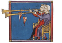 | [anafiles](png/anafiles.png) | [WebP](webp/anafiles.webp) | 964 × 670 | [128](webp/128/anafiles.webp) · [256](webp/256/anafiles.webp) · [512](webp/512/anafiles.webp) · [768](webp/768/anafiles.webp) |
| 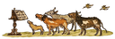 | [animal-choir-landscape](png/animal-choir-landscape.png) | [WebP](webp/animal-choir-landscape.webp) | 2135 × 737 | [128](webp/128/animal-choir-landscape.webp) · [256](webp/256/animal-choir-landscape.webp) · [512](webp/512/animal-choir-landscape.webp) · [768](webp/768/animal-choir-landscape.webp) |
| 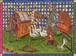 | [animal-musicians-ensemble](png/animal-musicians-ensemble.png) | [WebP](webp/animal-musicians-ensemble.webp) | 720 × 533 | [128](webp/128/animal-musicians-ensemble.webp) · [256](webp/256/animal-musicians-ensemble.webp) · [512](webp/512/animal-musicians-ensemble.webp) |
| 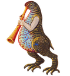 | [bird-wind-player](png/bird-wind-player.png) | [WebP](webp/bird-wind-player.webp) | 1211 × 1299 | [128](webp/128/bird-wind-player.webp) · [256](webp/256/bird-wind-player.webp) · [512](webp/512/bird-wind-player.webp) · [768](webp/768/bird-wind-player.webp) |
| 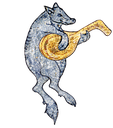 | [boar-lute-player](png/boar-lute-player.png) | [WebP](webp/boar-lute-player.webp) | 1177 × 1337 | [128](webp/128/boar-lute-player.webp) · [256](webp/256/boar-lute-player.webp) · [512](webp/512/boar-lute-player.webp) · [768](webp/768/boar-lute-player.webp) |
| 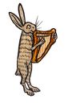 | [bunny-harp](png/bunny-harp.png) | [WebP](webp/bunny-harp.webp) | 1021 × 1541 | [128](webp/128/bunny-harp.webp) · [256](webp/256/bunny-harp.webp) · [512](webp/512/bunny-harp.webp) · [768](webp/768/bunny-harp.webp) |
| 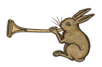 | [bunny-trumpet](png/bunny-trumpet.png) | [WebP](webp/bunny-trumpet.webp) | 1536 × 1024 | [128](webp/128/bunny-trumpet.webp) · [256](webp/256/bunny-trumpet.webp) · [512](webp/512/bunny-trumpet.webp) · [768](webp/768/bunny-trumpet.webp) |
|  | [canine-fiddle-player](png/canine-fiddle-player.png) | [WebP](webp/canine-fiddle-player.webp) | 1188 × 1324 | [128](webp/128/canine-fiddle-player.webp) · [256](webp/256/canine-fiddle-player.webp) · [512](webp/512/canine-fiddle-player.webp) · [768](webp/768/canine-fiddle-player.webp) |
| 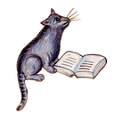 | [cat-reading-book](png/cat-reading-book.png) | [WebP](webp/cat-reading-book.webp) | 1254 × 1254 | [128](webp/128/cat-reading-book.webp) · [256](webp/256/cat-reading-book.webp) · [512](webp/512/cat-reading-book.webp) · [768](webp/768/cat-reading-book.webp) |
| 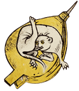 | [creature-in-gold-shape](png/creature-in-gold-shape.png) | [WebP](webp/creature-in-gold-shape.webp) | 563 × 650 | [128](webp/128/creature-in-gold-shape.webp) · [256](webp/256/creature-in-gold-shape.webp) · [512](webp/512/creature-in-gold-shape.webp) |
| 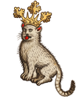 | [crowned-cat](png/crowned-cat.png) | [WebP](webp/crowned-cat.webp) | 1111 × 1415 | [128](webp/128/crowned-cat.webp) · [256](webp/256/crowned-cat.webp) · [512](webp/512/crowned-cat.webp) · [768](webp/768/crowned-cat.webp) |
| 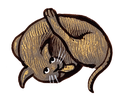 | [curled-cat](png/curled-cat.png) | [WebP](webp/curled-cat.webp) | 1414 × 1112 | [128](webp/128/curled-cat.webp) · [256](webp/256/curled-cat.webp) · [512](webp/512/curled-cat.webp) · [768](webp/768/curled-cat.webp) |
| 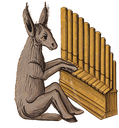 | [donkey-organist](png/donkey-organist.png) | [WebP](webp/donkey-organist.webp) | 1211 × 1299 | [128](webp/128/donkey-organist.webp) · [256](webp/256/donkey-organist.webp) · [512](webp/512/donkey-organist.webp) · [768](webp/768/donkey-organist.webp) |
| 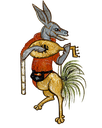 | [donkey-rooster-lute-player](png/donkey-rooster-lute-player.png) | [WebP](webp/donkey-rooster-lute-player.webp) | 1121 × 1403 | [128](webp/128/donkey-rooster-lute-player.webp) · [256](webp/256/donkey-rooster-lute-player.webp) · [512](webp/512/donkey-rooster-lute-player.webp) · [768](webp/768/donkey-rooster-lute-player.webp) |
| 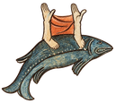 | [fish-with-arms](png/fish-with-arms.png) | [WebP](webp/fish-with-arms.webp) | 1325 × 1187 | [128](webp/128/fish-with-arms.webp) · [256](webp/256/fish-with-arms.webp) · [512](webp/512/fish-with-arms.webp) · [768](webp/768/fish-with-arms.webp) |
| 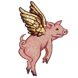 | [flying-pig](png/flying-pig.png) | [WebP](webp/flying-pig.webp) | 1254 × 1254 | [128](webp/128/flying-pig.webp) · [256](webp/256/flying-pig.webp) · [512](webp/512/flying-pig.webp) · [768](webp/768/flying-pig.webp) |
| 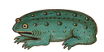 | [frog](png/frog.png) | [WebP](webp/frog.webp) | 1774 × 887 | [128](webp/128/frog.webp) · [256](webp/256/frog.webp) · [512](webp/512/frog.webp) · [768](webp/768/frog.webp) |
| 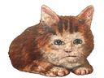 | [funny-faced-lying-cat](png/funny-faced-lying-cat.png) | [WebP](webp/funny-faced-lying-cat.webp) | 1448 × 1086 | [128](webp/128/funny-faced-lying-cat.webp) · [256](webp/256/funny-faced-lying-cat.webp) · [512](webp/512/funny-faced-lying-cat.webp) · [768](webp/768/funny-faced-lying-cat.webp) |
| 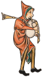 | [hooded-bagpiper](png/hooded-bagpiper.png) | [WebP](webp/hooded-bagpiper.webp) | 962 × 1635 | [128](webp/128/hooded-bagpiper.webp) · [256](webp/256/hooded-bagpiper.webp) · [512](webp/512/hooded-bagpiper.webp) · [768](webp/768/hooded-bagpiper.webp) |
| 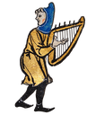 | [hooded-harp-player](png/hooded-harp-player.png) | [WebP](webp/hooded-harp-player.webp) | 1089 × 1444 | [128](webp/128/hooded-harp-player.webp) · [256](webp/256/hooded-harp-player.webp) · [512](webp/512/hooded-harp-player.webp) · [768](webp/768/hooded-harp-player.webp) |
|  | [lizard-lute-player](png/lizard-lute-player.png) | [WebP](webp/lizard-lute-player.webp) | 1024 × 1536 | [128](webp/128/lizard-lute-player.webp) · [256](webp/256/lizard-lute-player.webp) · [512](webp/512/lizard-lute-player.webp) · [768](webp/768/lizard-lute-player.webp) |
| 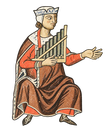 | [musician-r1-c1-organ-player](png/musician-r1-c1-organ-player.png) | [WebP](webp/musician-r1-c1-organ-player.webp) | 1143 × 1376 | [128](webp/128/musician-r1-c1-organ-player.webp) · [256](webp/256/musician-r1-c1-organ-player.webp) · [512](webp/512/musician-r1-c1-organ-player.webp) · [768](webp/768/musician-r1-c1-organ-player.webp) |
| 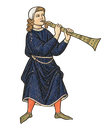 | [musician-r1-c2-shawm-player](png/musician-r1-c2-shawm-player.png) | [WebP](webp/musician-r1-c2-shawm-player.webp) | 1143 × 1376 | [128](webp/128/musician-r1-c2-shawm-player.webp) · [256](webp/256/musician-r1-c2-shawm-player.webp) · [512](webp/512/musician-r1-c2-shawm-player.webp) · [768](webp/768/musician-r1-c2-shawm-player.webp) |
| 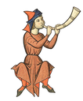 | [musician-r1-c3-horn-player](png/musician-r1-c3-horn-player.png) | [WebP](webp/musician-r1-c3-horn-player.webp) | 1143 × 1376 | [128](webp/128/musician-r1-c3-horn-player.webp) · [256](webp/256/musician-r1-c3-horn-player.webp) · [512](webp/512/musician-r1-c3-horn-player.webp) · [768](webp/768/musician-r1-c3-horn-player.webp) |
| 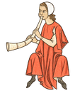 | [musician-r1-c4-horn-player](png/musician-r1-c4-horn-player.png) | [WebP](webp/musician-r1-c4-horn-player.webp) | 1143 × 1376 | [128](webp/128/musician-r1-c4-horn-player.webp) · [256](webp/256/musician-r1-c4-horn-player.webp) · [512](webp/512/musician-r1-c4-horn-player.webp) · [768](webp/768/musician-r1-c4-horn-player.webp) |
| 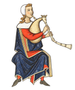 | [musician-r2-c1-bagpiper](png/musician-r2-c1-bagpiper.png) | [WebP](webp/musician-r2-c1-bagpiper.webp) | 1143 × 1376 | [128](webp/128/musician-r2-c1-bagpiper.webp) · [256](webp/256/musician-r2-c1-bagpiper.webp) · [512](webp/512/musician-r2-c1-bagpiper.webp) · [768](webp/768/musician-r2-c1-bagpiper.webp) |
| 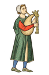 | [musician-r2-c2-bagpiper](png/musician-r2-c2-bagpiper.png) | [WebP](webp/musician-r2-c2-bagpiper.webp) | 1024 × 1536 | [128](webp/128/musician-r2-c2-bagpiper.webp) · [256](webp/256/musician-r2-c2-bagpiper.webp) · [512](webp/512/musician-r2-c2-bagpiper.webp) · [768](webp/768/musician-r2-c2-bagpiper.webp) |
| 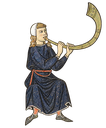 | [musician-r2-c3-horn-player](png/musician-r2-c3-horn-player.png) | [WebP](webp/musician-r2-c3-horn-player.webp) | 1143 × 1376 | [128](webp/128/musician-r2-c3-horn-player.webp) · [256](webp/256/musician-r2-c3-horn-player.webp) · [512](webp/512/musician-r2-c3-horn-player.webp) · [768](webp/768/musician-r2-c3-horn-player.webp) |
| 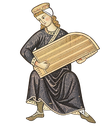 | [musician-r2-c4-psaltery-player](png/musician-r2-c4-psaltery-player.png) | [WebP](webp/musician-r2-c4-psaltery-player.webp) | 1143 × 1376 | [128](webp/128/musician-r2-c4-psaltery-player.webp) · [256](webp/256/musician-r2-c4-psaltery-player.webp) · [512](webp/512/musician-r2-c4-psaltery-player.webp) · [768](webp/768/musician-r2-c4-psaltery-player.webp) |
| 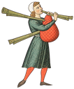 | [musician-r3-c1-bagpiper](png/musician-r3-c1-bagpiper.png) | [WebP](webp/musician-r3-c1-bagpiper.webp) | 1143 × 1376 | [128](webp/128/musician-r3-c1-bagpiper.webp) · [256](webp/256/musician-r3-c1-bagpiper.webp) · [512](webp/512/musician-r3-c1-bagpiper.webp) · [768](webp/768/musician-r3-c1-bagpiper.webp) |
| 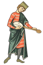 | [musician-r3-c2-lute-player](png/musician-r3-c2-lute-player.png) | [WebP](webp/musician-r3-c2-lute-player.webp) | 1024 × 1536 | [128](webp/128/musician-r3-c2-lute-player.webp) · [256](webp/256/musician-r3-c2-lute-player.webp) · [512](webp/512/musician-r3-c2-lute-player.webp) · [768](webp/768/musician-r3-c2-lute-player.webp) |
| 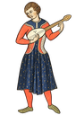 | [musician-r3-c3-lute-player](png/musician-r3-c3-lute-player.png) | [WebP](webp/musician-r3-c3-lute-player.webp) | 1024 × 1536 | [128](webp/128/musician-r3-c3-lute-player.webp) · [256](webp/256/musician-r3-c3-lute-player.webp) · [512](webp/512/musician-r3-c3-lute-player.webp) · [768](webp/768/musician-r3-c3-lute-player.webp) |
| 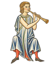 | [musician-r3-c4-pipe-player](png/musician-r3-c4-pipe-player.png) | [WebP](webp/musician-r3-c4-pipe-player.webp) | 1143 × 1376 | [128](webp/128/musician-r3-c4-pipe-player.webp) · [256](webp/256/musician-r3-c4-pipe-player.webp) · [512](webp/512/musician-r3-c4-pipe-player.webp) · [768](webp/768/musician-r3-c4-pipe-player.webp) |
| 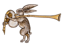 | [rabbit-bagpiper](png/rabbit-bagpiper.png) | [WebP](webp/rabbit-bagpiper.webp) | 1484 × 1060 | [128](webp/128/rabbit-bagpiper.webp) · [256](webp/256/rabbit-bagpiper.webp) · [512](webp/512/rabbit-bagpiper.webp) · [768](webp/768/rabbit-bagpiper.webp) |
| 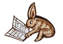 | [rabbit-reading-book](png/rabbit-reading-book.png) | [WebP](webp/rabbit-reading-book.webp) | 1500 × 1049 | [128](webp/128/rabbit-reading-book.webp) · [256](webp/256/rabbit-reading-book.webp) · [512](webp/512/rabbit-reading-book.webp) · [768](webp/768/rabbit-reading-book.webp) |
| 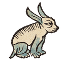 | [seated-rabbit](png/seated-rabbit.png) | [WebP](webp/seated-rabbit.webp) | 1295 × 1214 | [128](webp/128/seated-rabbit.webp) · [256](webp/256/seated-rabbit.webp) · [512](webp/512/seated-rabbit.webp) · [768](webp/768/seated-rabbit.webp) |
| 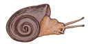 | [snail](png/snail.png) | [WebP](webp/snail.webp) | 1774 × 887 | [128](webp/128/snail.webp) · [256](webp/256/snail.webp) · [512](webp/512/snail.webp) · [768](webp/768/snail.webp) |
| 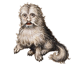 | [weird-dog](png/weird-dog.png) | [WebP](webp/weird-dog.webp) | 1385 × 1136 | [128](webp/128/weird-dog.webp) · [256](webp/256/weird-dog.webp) · [512](webp/512/weird-dog.webp) · [768](webp/768/weird-dog.webp) |
| 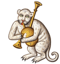 | [white-animal-bagpiper](png/white-animal-bagpiper.png) | [WebP](webp/white-animal-bagpiper.webp) | 1213 × 1296 | [128](webp/128/white-animal-bagpiper.webp) · [256](webp/256/white-animal-bagpiper.webp) · [512](webp/512/white-animal-bagpiper.webp) · [768](webp/768/white-animal-bagpiper.webp) |
| 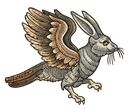 | [winged-rabbit](png/winged-rabbit.png) | [WebP](webp/winged-rabbit.webp) | 1360 × 1156 | [128](webp/128/winged-rabbit.webp) · [256](webp/256/winged-rabbit.webp) · [512](webp/512/winged-rabbit.webp) · [768](webp/768/winged-rabbit.webp) |
