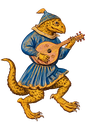

# Medieval cutouts

33 medieval manuscript-style figures and musicians, each available as a transparent PNG and a lossless WebP.

PNG originals are in [`png/`](png/); matching WebP versions are in [`webp/`](webp/). Both formats retain the same dimensions and transparency. [`images.json`](images.json) lists original files and every smaller variant, with exact paths, dimensions, and file sizes.

The twelve musicians from the three-row, four-column illustration use `r1-c1` through `r3-c4` in their filenames.

Cutouts were prepared from supplied illustrations using image generation and background extraction. WebP conversion is lossless; visible pixels and alpha channels were checked against the PNG originals.

## Smaller sizes

Every image has 128, 256, 512, and 768 pixel versions in both formats. The number is the **longest edge**, so a portrait image stays portrait and a landscape image stays landscape. Images are never cropped, stretched, or enlarged. Future source images smaller than a requested size are skipped for that size.

| Longest edge | PNG folder | WebP folder | Example use |
| --- | --- | --- | --- |
| 128 px | [`png/128/`](png/128/) | [`webp/128/`](webp/128/) | Small corner decorations and thumbnails |
| 256 px | [`png/256/`](png/256/) | [`webp/256/`](webp/256/) | Small decorations on high-density displays |
| 512 px | [`png/512/`](png/512/) | [`webp/512/`](webp/512/) | Medium illustrations |
| 768 px | [`png/768/`](png/768/) | [`webp/768/`](webp/768/) | Larger illustrations |
| Original | [`png/`](png/) | [`webp/`](webp/) | Full resolution |

Each smaller version is generated directly from the original PNG using Lanczos resampling, keeping transparent edges. PNG and WebP encoding is lossless after resizing. Originals and their URLs remain unchanged.

## Use in another project

Link directly to the desired size:

```text
https://raw.githubusercontent.com/adrian729/medieval-cutouts/main/webp/128/flying-pig.webp
https://raw.githubusercontent.com/adrian729/medieval-cutouts/main/png/256/flying-pig.png
```

For a 128-pixel square flying pig, this lets the browser choose a 128-pixel image on a normal display or a 256-pixel image on a display with twice the pixel density:

```html

```

Other images have different proportions; use their actual dimensions from `images.json`. Use a commit SHA in place of `main` if you need a fixed version of an image. See [MDN's image documentation](https://developer.mozilla.org/en-US/docs/Web/HTML/Reference/Elements/img#srcset) for browser size selection.

## Regenerate sizes

```sh
python3 -m pip install -r requirements.txt
python3 scripts/generate_sizes.py
```

The script verifies dimensions, transparency, matching visible PNG/WebP pixels, and that every original remains byte-for-byte unchanged. See [Pillow's thumbnail documentation](https://pillow.readthedocs.io/en/stable/reference/Image.html#PIL.Image.Image.thumbnail) for the downscaling operation.

## Images

| Preview | Original PNG | Original WebP | Original dimensions | Smaller WebP |
| --- | --- | --- | --- | --- |
|  | [anafiles](png/anafiles.png) | [WebP](webp/anafiles.webp) | 964 × 670 | [128](webp/128/anafiles.webp) · [256](webp/256/anafiles.webp) · [512](webp/512/anafiles.webp) · [768](webp/768/anafiles.webp) |
|  | [bird-wind-player](png/bird-wind-player.png) | [WebP](webp/bird-wind-player.webp) | 1211 × 1299 | [128](webp/128/bird-wind-player.webp) · [256](webp/256/bird-wind-player.webp) · [512](webp/512/bird-wind-player.webp) · [768](webp/768/bird-wind-player.webp) |
|  | [blue-animal-horn-player](png/blue-animal-horn-player.png) | [WebP](webp/blue-animal-horn-player.webp) | 1177 × 1337 | [128](webp/128/blue-animal-horn-player.webp) · [256](webp/256/blue-animal-horn-player.webp) · [512](webp/512/blue-animal-horn-player.webp) · [768](webp/768/blue-animal-horn-player.webp) |
|  | [bunny-harp](png/bunny-harp.png) | [WebP](webp/bunny-harp.webp) | 1021 × 1541 | [128](webp/128/bunny-harp.webp) · [256](webp/256/bunny-harp.webp) · [512](webp/512/bunny-harp.webp) · [768](webp/768/bunny-harp.webp) |
|  | [bunny-trumpet](png/bunny-trumpet.png) | [WebP](webp/bunny-trumpet.webp) | 1536 × 1024 | [128](webp/128/bunny-trumpet.webp) · [256](webp/256/bunny-trumpet.webp) · [512](webp/512/bunny-trumpet.webp) · [768](webp/768/bunny-trumpet.webp) |
|  | [canine-fiddle-player](png/canine-fiddle-player.png) | [WebP](webp/canine-fiddle-player.webp) | 1188 × 1324 | [128](webp/128/canine-fiddle-player.webp) · [256](webp/256/canine-fiddle-player.webp) · [512](webp/512/canine-fiddle-player.webp) · [768](webp/768/canine-fiddle-player.webp) |
|  | [crowned-cat](png/crowned-cat.png) | [WebP](webp/crowned-cat.webp) | 1111 × 1415 | [128](webp/128/crowned-cat.webp) · [256](webp/256/crowned-cat.webp) · [512](webp/512/crowned-cat.webp) · [768](webp/768/crowned-cat.webp) |
|  | [curled-cat](png/curled-cat.png) | [WebP](webp/curled-cat.webp) | 1414 × 1112 | [128](webp/128/curled-cat.webp) · [256](webp/256/curled-cat.webp) · [512](webp/512/curled-cat.webp) · [768](webp/768/curled-cat.webp) |
|  | [donkey-organist](png/donkey-organist.png) | [WebP](webp/donkey-organist.webp) | 1211 × 1299 | [128](webp/128/donkey-organist.webp) · [256](webp/256/donkey-organist.webp) · [512](webp/512/donkey-organist.webp) · [768](webp/768/donkey-organist.webp) |
|  | [dragon-lute-player](png/dragon-lute-player.png) | [WebP](webp/dragon-lute-player.webp) | 1024 × 1536 | [128](webp/128/dragon-lute-player.webp) · [256](webp/256/dragon-lute-player.webp) · [512](webp/512/dragon-lute-player.webp) · [768](webp/768/dragon-lute-player.webp) |
|  | [fish-with-legs](png/fish-with-legs.png) | [WebP](webp/fish-with-legs.webp) | 1325 × 1187 | [128](webp/128/fish-with-legs.webp) · [256](webp/256/fish-with-legs.webp) · [512](webp/512/fish-with-legs.webp) · [768](webp/768/fish-with-legs.webp) |
|  | [flying-pig](png/flying-pig.png) | [WebP](webp/flying-pig.webp) | 1254 × 1254 | [128](webp/128/flying-pig.webp) · [256](webp/256/flying-pig.webp) · [512](webp/512/flying-pig.webp) · [768](webp/768/flying-pig.webp) |
|  | [frog](png/frog.png) | [WebP](webp/frog.webp) | 1774 × 887 | [128](webp/128/frog.webp) · [256](webp/256/frog.webp) · [512](webp/512/frog.webp) · [768](webp/768/frog.webp) |
|  | [hooded-bagpiper](png/hooded-bagpiper.png) | [WebP](webp/hooded-bagpiper.webp) | 962 × 1635 | [128](webp/128/hooded-bagpiper.webp) · [256](webp/256/hooded-bagpiper.webp) · [512](webp/512/hooded-bagpiper.webp) · [768](webp/768/hooded-bagpiper.webp) |
|  | [musician-r1-c1-organ-player](png/musician-r1-c1-organ-player.png) | [WebP](webp/musician-r1-c1-organ-player.webp) | 1143 × 1376 | [128](webp/128/musician-r1-c1-organ-player.webp) · [256](webp/256/musician-r1-c1-organ-player.webp) · [512](webp/512/musician-r1-c1-organ-player.webp) · [768](webp/768/musician-r1-c1-organ-player.webp) |
|  | [musician-r1-c2-shawm-player](png/musician-r1-c2-shawm-player.png) | [WebP](webp/musician-r1-c2-shawm-player.webp) | 1143 × 1376 | [128](webp/128/musician-r1-c2-shawm-player.webp) · [256](webp/256/musician-r1-c2-shawm-player.webp) · [512](webp/512/musician-r1-c2-shawm-player.webp) · [768](webp/768/musician-r1-c2-shawm-player.webp) |
|  | [musician-r1-c3-horn-player](png/musician-r1-c3-horn-player.png) | [WebP](webp/musician-r1-c3-horn-player.webp) | 1143 × 1376 | [128](webp/128/musician-r1-c3-horn-player.webp) · [256](webp/256/musician-r1-c3-horn-player.webp) · [512](webp/512/musician-r1-c3-horn-player.webp) · [768](webp/768/musician-r1-c3-horn-player.webp) |
|  | [musician-r1-c4-horn-player](png/musician-r1-c4-horn-player.png) | [WebP](webp/musician-r1-c4-horn-player.webp) | 1143 × 1376 | [128](webp/128/musician-r1-c4-horn-player.webp) · [256](webp/256/musician-r1-c4-horn-player.webp) · [512](webp/512/musician-r1-c4-horn-player.webp) · [768](webp/768/musician-r1-c4-horn-player.webp) |
|  | [musician-r2-c1-bagpiper](png/musician-r2-c1-bagpiper.png) | [WebP](webp/musician-r2-c1-bagpiper.webp) | 1143 × 1376 | [128](webp/128/musician-r2-c1-bagpiper.webp) · [256](webp/256/musician-r2-c1-bagpiper.webp) · [512](webp/512/musician-r2-c1-bagpiper.webp) · [768](webp/768/musician-r2-c1-bagpiper.webp) |
|  | [musician-r2-c2-bagpiper](png/musician-r2-c2-bagpiper.png) | [WebP](webp/musician-r2-c2-bagpiper.webp) | 1024 × 1536 | [128](webp/128/musician-r2-c2-bagpiper.webp) · [256](webp/256/musician-r2-c2-bagpiper.webp) · [512](webp/512/musician-r2-c2-bagpiper.webp) · [768](webp/768/musician-r2-c2-bagpiper.webp) |
|  | [musician-r2-c3-horn-player](png/musician-r2-c3-horn-player.png) | [WebP](webp/musician-r2-c3-horn-player.webp) | 1143 × 1376 | [128](webp/128/musician-r2-c3-horn-player.webp) · [256](webp/256/musician-r2-c3-horn-player.webp) · [512](webp/512/musician-r2-c3-horn-player.webp) · [768](webp/768/musician-r2-c3-horn-player.webp) |
|  | [musician-r2-c4-psaltery-player](png/musician-r2-c4-psaltery-player.png) | [WebP](webp/musician-r2-c4-psaltery-player.webp) | 1143 × 1376 | [128](webp/128/musician-r2-c4-psaltery-player.webp) · [256](webp/256/musician-r2-c4-psaltery-player.webp) · [512](webp/512/musician-r2-c4-psaltery-player.webp) · [768](webp/768/musician-r2-c4-psaltery-player.webp) |
|  | [musician-r3-c1-bagpiper](png/musician-r3-c1-bagpiper.png) | [WebP](webp/musician-r3-c1-bagpiper.webp) | 1143 × 1376 | [128](webp/128/musician-r3-c1-bagpiper.webp) · [256](webp/256/musician-r3-c1-bagpiper.webp) · [512](webp/512/musician-r3-c1-bagpiper.webp) · [768](webp/768/musician-r3-c1-bagpiper.webp) |
|  | [musician-r3-c2-lute-player](png/musician-r3-c2-lute-player.png) | [WebP](webp/musician-r3-c2-lute-player.webp) | 1024 × 1536 | [128](webp/128/musician-r3-c2-lute-player.webp) · [256](webp/256/musician-r3-c2-lute-player.webp) · [512](webp/512/musician-r3-c2-lute-player.webp) · [768](webp/768/musician-r3-c2-lute-player.webp) |
|  | [musician-r3-c3-lute-player](png/musician-r3-c3-lute-player.png) | [WebP](webp/musician-r3-c3-lute-player.webp) | 1024 × 1536 | [128](webp/128/musician-r3-c3-lute-player.webp) · [256](webp/256/musician-r3-c3-lute-player.webp) · [512](webp/512/musician-r3-c3-lute-player.webp) · [768](webp/768/musician-r3-c3-lute-player.webp) |
|  | [musician-r3-c4-pipe-player](png/musician-r3-c4-pipe-player.png) | [WebP](webp/musician-r3-c4-pipe-player.webp) | 1143 × 1376 | [128](webp/128/musician-r3-c4-pipe-player.webp) · [256](webp/256/musician-r3-c4-pipe-player.webp) · [512](webp/512/musician-r3-c4-pipe-player.webp) · [768](webp/768/musician-r3-c4-pipe-player.webp) |
|  | [rabbit-bagpiper](png/rabbit-bagpiper.png) | [WebP](webp/rabbit-bagpiper.webp) | 1484 × 1060 | [128](webp/128/rabbit-bagpiper.webp) · [256](webp/256/rabbit-bagpiper.webp) · [512](webp/512/rabbit-bagpiper.webp) · [768](webp/768/rabbit-bagpiper.webp) |
|  | [rabbit-lute-player](png/rabbit-lute-player.png) | [WebP](webp/rabbit-lute-player.webp) | 1121 × 1403 | [128](webp/128/rabbit-lute-player.webp) · [256](webp/256/rabbit-lute-player.webp) · [512](webp/512/rabbit-lute-player.webp) · [768](webp/768/rabbit-lute-player.webp) |
|  | [seated-rabbit](png/seated-rabbit.png) | [WebP](webp/seated-rabbit.webp) | 1295 × 1214 | [128](webp/128/seated-rabbit.webp) · [256](webp/256/seated-rabbit.webp) · [512](webp/512/seated-rabbit.webp) · [768](webp/768/seated-rabbit.webp) |
|  | [snail](png/snail.png) | [WebP](webp/snail.webp) | 1774 × 887 | [128](webp/128/snail.webp) · [256](webp/256/snail.webp) · [512](webp/512/snail.webp) · [768](webp/768/snail.webp) |
|  | [weird-dog](png/weird-dog.png) | [WebP](webp/weird-dog.webp) | 1385 × 1136 | [128](webp/128/weird-dog.webp) · [256](webp/256/weird-dog.webp) · [512](webp/512/weird-dog.webp) · [768](webp/768/weird-dog.webp) |
|  | [white-animal-bagpiper](png/white-animal-bagpiper.png) | [WebP](webp/white-animal-bagpiper.webp) | 1213 × 1296 | [128](webp/128/white-animal-bagpiper.webp) · [256](webp/256/white-animal-bagpiper.webp) · [512](webp/512/white-animal-bagpiper.webp) · [768](webp/768/white-animal-bagpiper.webp) |
|  | [winged-rabbit](png/winged-rabbit.png) | [WebP](webp/winged-rabbit.webp) | 1360 × 1156 | [128](webp/128/winged-rabbit.webp) · [256](webp/256/winged-rabbit.webp) · [512](webp/512/winged-rabbit.webp) · [768](webp/768/winged-rabbit.webp) |
